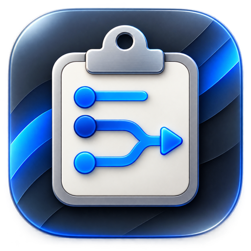
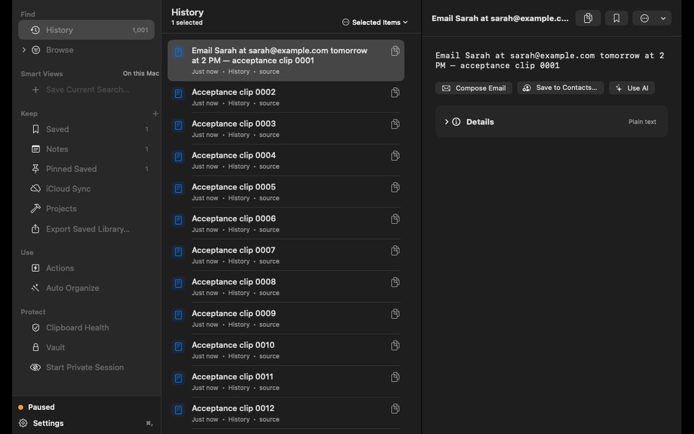
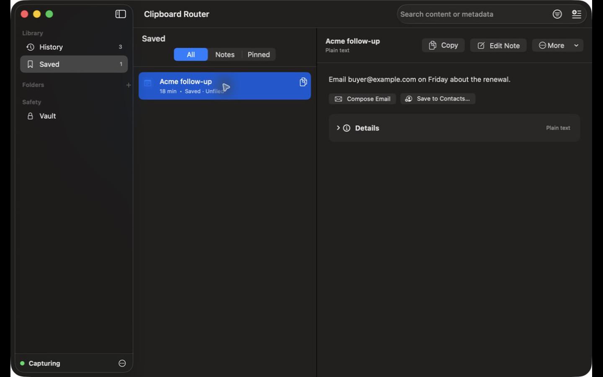
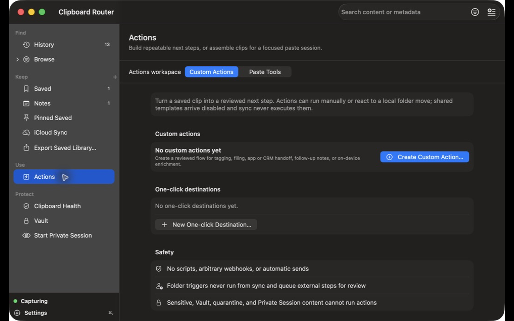

<div align="center">



# Clipboard Router

**A native macOS clipboard workspace that keeps your history on your Mac—and never sends a clip anywhere you didn't choose.**

[](https://github.com/ibrolord/clipboard-router-releases/releases/latest)


**[Download v0.1.0](https://github.com/ibrolord/clipboard-router-releases/releases/download/v0.1.0/Clipboard-Router-0.1.0-arm64.zip)** · 8.6 MB · Apple Silicon

```bash
brew install --cask ibrolord/tap/clipboard-router
```

</div>

<div align="center">
  
</div>

---

## The clipboard remembers everything. It should earn that access.

Clipboard managers are useful precisely because they can see what you copy: code, links, addresses, unfinished messages, API keys, and sometimes things you never meant to keep.

Clipboard Router is designed around that uncomfortable fact.

- **Local by default.** History, saved clips, notes, folders, Private Sessions, Sensitive Review, and Vault operate on your Mac. This build has no analytics transport.
- **Routes, never submits.** A handoff copies the reviewed clip and opens its destination. You still paste. You still press Send.
- **Sensitive paths fail closed.** Secret-like content is separated from ordinary history. Private Session clips stay in memory. Vault items require authentication before reveal.

## Built for the work between apps

- Recover the stack trace, command, URL, or snippet you copied five minutes ago.
- Turn reusable addresses, replies, links, and project context into saved items, notes, folders, and Smart Views.
- Assemble several fragments into a Paste Stack, or preview repeatable organization rules without invisible automation.
- Quarantine suspicious content, start a memory-only Private Session, protect a clip in Vault, or share eligible text through an explicit portable format.

## Core features

| | |
|---|---|
| **Searchable clipboard history** | Capture text, URLs, rich text, images, and file references. Search content and metadata, including source app, domain, type, and date. |
| **Menu-bar workflow** | Reach recent clips, Quick Paste, notes, and the full library without living in another Dock app. |
| **Saved clips, notes, and folders** | Promote useful material out of ephemeral history. Pin it, edit it, nest it, and find it again. |
| **Smart Views** | Save a validated search as a reusable view for the material you reach for repeatedly. |
| **Actions and Paste Stack** | Build reviewed next steps or assemble several clips for a focused paste session. No arbitrary scripts or automatic sends. |
| **Auto Organize** | Deterministic local rules over content type, domain, source app, and other bounded signals. Preview first; undo afterward. |
| **Clipboard Health** | Detect secret-like values in captured text and OCR-extracted image text, then review them separately from ordinary history. |
| **Private Session** | Temporarily stop writing new clips to disk. Session clips remain in memory and are destroyed when cleared or ended. |
| **Vault** | Encrypt clips you deliberately protect and require authentication before revealing them. Vault remains local only. |
| **Portable and encrypted sharing** | Copy eligible text or URLs as reversible Base64—clearly labeled as encoding, not encryption—or create a recipient-key encrypted share with replay protection. |
| **Native macOS app** | Keyboard shortcuts, drag-and-drop organization, a three-column library, Apple Developer ID signing, and Apple notarization. |
| **Bundled `cr` CLI** | A version-matched command-line tool for deliberate analyze/transform pipelines. Nothing changes your `PATH` unless you export it yourself. |

<details>
<summary><b>More screenshots</b></summary>
<br>

<br><br>

</details>

## Privacy and security boundary

Clipboard software has unusual access, so these claims are deliberately literal.

### What stays local

- Clipboard history, saved clips, notes, folders, Smart Views, quarantined items, Private Sessions, and Vault data are local application data.
- Vault content is encrypted and authentication-gated. Ordinary history is local, but it is **not** described as Vault-encrypted content.
- The bundled privacy manifest declares no tracking and no tracking domains. It conservatively declares “Other User Content” linked to the user for optional, user-initiated sends; the local workspace does not transmit clipboard content by default.

### What can leave—and only when you act

- Choosing a handoff copies a reviewed clip and opens the destination. Clipboard Router does not claim that opening an app means submitting to it.
- Optional online services and platform permissions are invoked only after explicit configuration or action. The destination service's privacy terms then apply.
- Accessibility is optional and used only to synthesize paste into the app you selected. Without it, Clipboard Router leaves the clip copied for a manual paste.
- Calendar, Contacts, and Location permission denials do not prevent ordinary capture, search, saving, notes, folders, Private Sessions, or Vault use.

### What no clipboard manager can protect

The macOS pasteboard is shared. Other running applications may read it. Vault encryption at rest cannot protect a clip while you have deliberately placed its plaintext on the system pasteboard.

Read the full **[privacy policy](PRIVACY.md)**.

> **Transparency:** Clipboard Router is currently distributed as a closed-source binary. This repository contains releases, checksums, build-provenance manifests, documentation, and the public issue tracker—not the application source. What you can independently verify today is the exact download hash, Apple signature, hardened runtime, notarization ticket, bundle metadata, and published provenance record.

## Install

### Homebrew

```bash
brew install --cask ibrolord/tap/clipboard-router
```

### Direct download

1. Download **[Clipboard-Router-0.1.0-arm64.zip](https://github.com/ibrolord/clipboard-router-releases/releases/download/v0.1.0/Clipboard-Router-0.1.0-arm64.zip)**.
2. Unzip it and move **Clipboard Router.app** to `/Applications`.
3. Launch it. Clipboard Router appears in the menu bar and intentionally has no persistent Dock icon.

The app supports **macOS 14 Sonoma or later** on **Apple Silicon**. v0.1.0 does not include an Intel or universal binary.

## Verify before installing

Every release includes a SHA-256 sidecar and `ClipboardRouter-0.1.0.app.release.json`, a build-provenance manifest. The copy embedded inside the application bundle is covered by the app's code signature.

```bash
shasum -a 256 ~/Downloads/Clipboard-Router-0.1.0-arm64.zip
```

Expected for v0.1.0:

```text
44d4c15cee3d5f155bdad65089434a93dc19baf1fe03dd247db7f9d50046cda6
```

After installation, verify the signature, Gatekeeper assessment, and stapled notarization ticket:

```bash
codesign --verify --strict --verbose=2 "/Applications/Clipboard Router.app"
spctl -a -vv --type execute "/Applications/Clipboard Router.app"
xcrun stapler validate "/Applications/Clipboard Router.app"
```

Gatekeeper should report `source=Notarized Developer ID`. Download only from this repository or the `ibrolord/tap` Homebrew tap.

## Why I built it

I kept repeating the same workflow: copy a stack trace into a chat window, copy a customer detail into another tool, then copy a token I immediately wished had never entered clipboard history.

Most clipboard tools optimize the first two moments. Clipboard Router starts with the third.

Private Session exists because sometimes the right amount of history is none. Vault is authentication-gated because “hidden” is not the same as protected. Routing stops at copy-and-open because an app with total clipboard visibility should not also decide when your data leaves your machine.

That costs one extra keystroke. I would rather own that keystroke.

## Release status

**v0.1.0 is an initial free release.** No account, purchase, subscription, or license key is required for the local workspace.

- Apple Silicon only; a universal build is not available yet.
- The public download is signed with Apple Developer ID, notarized, stapled, and independently verifiable.
- iCloud sync, CRM connectors, and hosted AI are not supported v0.1.0 features. Development surfaces may appear disabled in the interface.
- The release test suite establishes tested local contracts, not an independent security audit or compatibility with every destination-app version.

Feedback will shape what comes next: universal binaries, production-proven opt-in sync for saved items, and carefully bounded assistant integrations are candidates—not promises or dates.

## Uninstall

```bash
brew uninstall --zap --cask clipboard-router
```

For a manual installation, quit Clipboard Router and move **Clipboard Router.app** to the Trash. Its sandbox data is stored under `~/Library/Containers/com.clipboardrouter.ClipboardRouter`; removing that container permanently deletes history, saved clips, notes, and Vault data.

## Support

Found a bug or have a use case this should handle? **[Open an issue](https://github.com/ibrolord/clipboard-router-releases/issues)**.

Include the Clipboard Router version, macOS version, Mac model, and reproduction steps. Never include clipboard contents, credentials, license keys, or other secrets.

- [Support guide](SUPPORT.md)
- [Privacy policy](PRIVACY.md)
